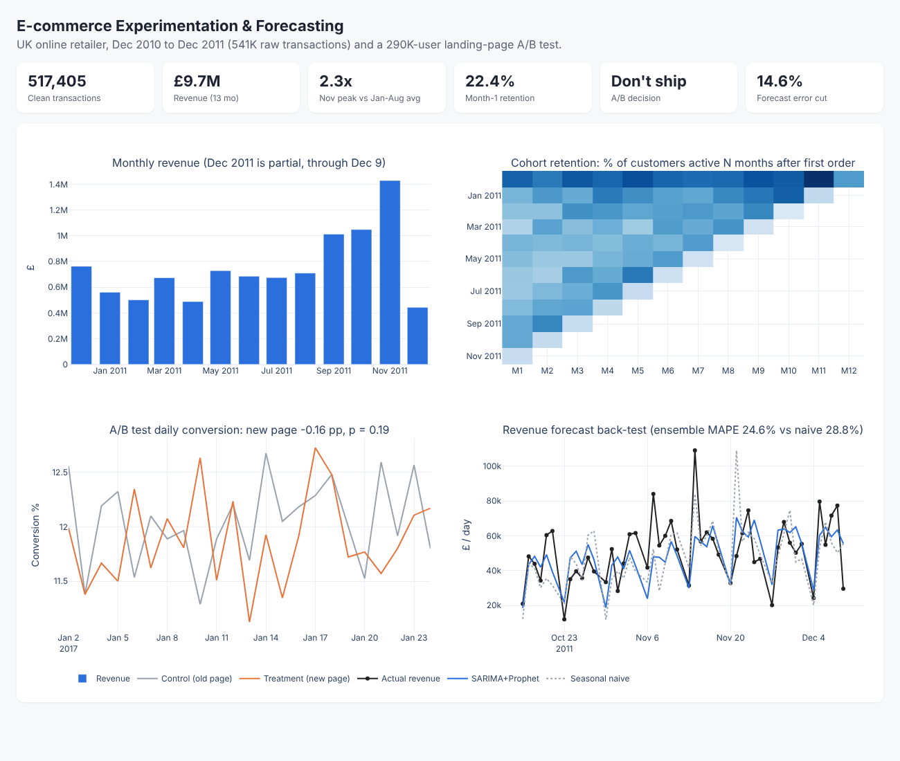

# E-commerce Experimentation & Forecasting

End-to-end retail analytics project: **PySpark / Spark SQL** ETL and KPIs, **cohort retention**, a **landing-page A/B test**, and **daily revenue forecasting** with a walk-forward back-test, summarized in an interactive dashboard.



## Data (public)
| Dataset | Rows | Source |
|---|---|---|
| UK online retailer transactions, Dec 2010 to Dec 2011 (UCI Online Retail) | 541,909 | Databricks *Spark: The Definitive Guide* repo |
| Landing-page A/B test (old vs new page, conversion) | 294,478 | Udacity "Analyze A/B Test Results" dataset |

`bash data/download.sh` fetches both.

## Run
```bash
python -m venv .venv && source .venv/bin/activate && pip install -r requirements.txt
python src/01_etl_kpis_spark.py   # Spark cleaning + Spark SQL KPI / cohort tables  -> outputs/tables
python src/02_ab_test.py          # A/B test analysis                               -> outputs/tables/ab_results.json
python src/03_forecast.py         # SARIMA / Prophet back-test                      -> outputs/tables/forecast_metrics.json
python src/04_dashboard.py        # interactive dashboard                           -> outputs/dashboard.html
```
SQL lives in `sql/` (daily/monthly KPIs, country mix, cohort retention). CSVs in `outputs/tables/` are Tableau-ready.

## Key findings

**1. Data quality and KPIs (PySpark, Spark SQL)**
- Removed 9,288 cancellations, 5,268 duplicates, 11,805 non-positive quantity/price rows, non-product fees, and 5,563 purchases later reversed by a matching cancellation (e.g. one 80,995-unit order cancelled the same day). 517,405 clean rows remain.
- £9.7M revenue over 13 months; UK is ~85% of revenue.
- Strong Q4 seasonality: November revenue is **2.3x** the Jan to Aug monthly average.

**2. Cohort retention**
- Only **22.4%** of new customers order again the month after their first purchase, and retention stays roughly flat after that, so first-to-second purchase is the key lever.
- The Dec 2010 cohort looks far stickier (~35 to 40%) because it includes pre-existing customers (data starts Dec 2010): a left-censoring artifact, not a real effect.

**3. A/B test: new landing page (290,584 users after cleaning)**
- Dropped 3,893 rows where the group and page shown disagreed, plus 1 duplicate user. Sample-ratio check passes (p = 0.95).
- Control 12.04% vs treatment 11.88%: **-0.16 pp, p = 0.19**, 95% CI [-0.39, +0.08] pp (bootstrap agrees).
- With this sample, the minimum detectable effect at 80% power is 0.35 pp, so a meaningful lift would have been caught. Lift is positive on only 2 of 7 weekdays.
- **Recommendation: do not ship.** The best plausible upside (+0.08 pp) does not justify the change.

**4. Forecasting daily revenue**
- Trading-day series (store closed Saturdays), log revenue, 8 weekly walk-forward folds (Oct 16 to Dec 9, 2011, the hardest peak season), 1-week horizon, refit each fold.

| Model | MAPE | WAPE |
|---|---|---|
| Seasonal naive (same day last week) | 28.8% | 26.6% |
| SARIMA(1,1,1)(1,0,1,6) | 26.5% | 24.7% |
| Prophet | 26.0% | 23.7% |
| **SARIMA + Prophet average** | **24.6%** | **22.7%** |

The ensemble cuts MAPE by **14.6%** vs the naive baseline. Daily B2B-style retail revenue is lumpy (a few wholesale orders swing a day), so errors stay high; weekly aggregation or order-count forecasting would be the next step.

## Limitations
- Model choice was made on the same back-test window it is reported on; a held-out final month would be stricter.
- The A/B dataset has no device or traffic-source fields, so segment analysis is limited to time.
